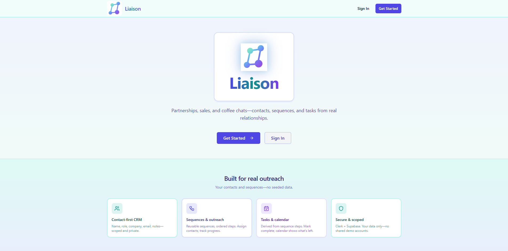
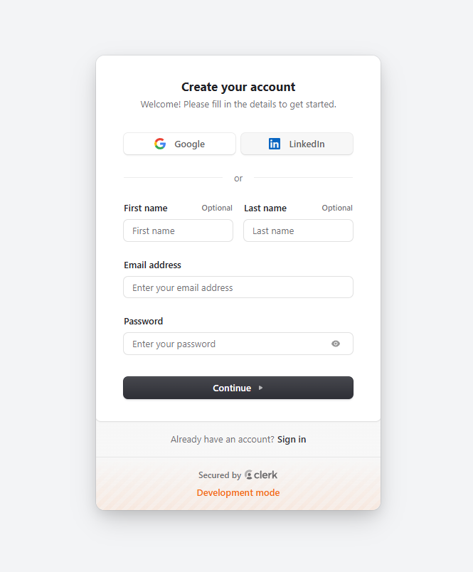
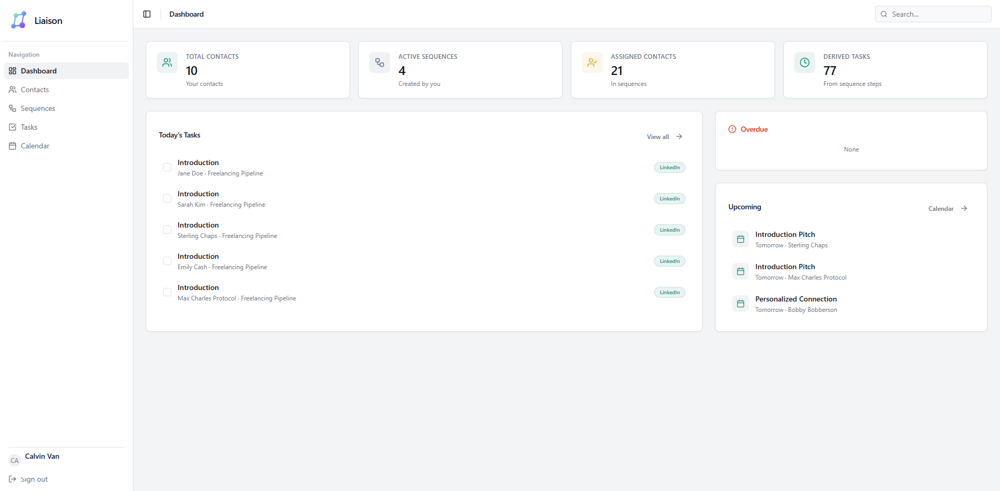
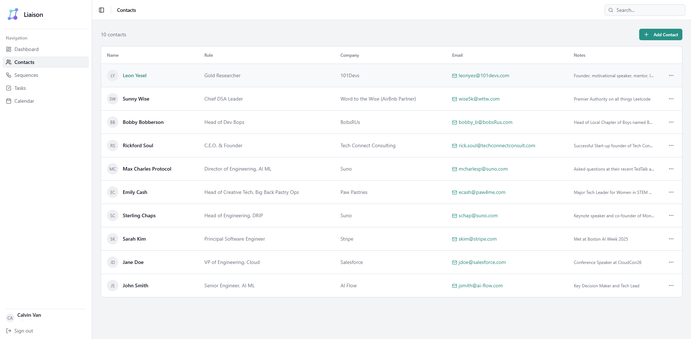
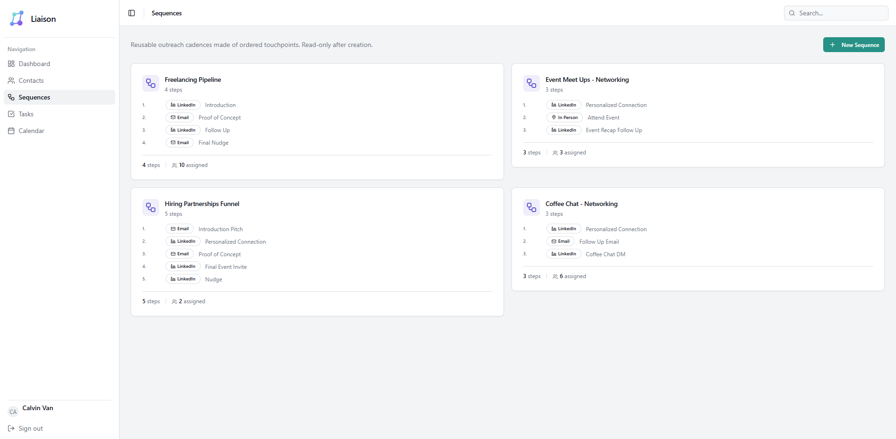

# Liaison

**Lightweight relationship and outreach management** for professionals—sales prospects, partnerships, recruiting leads, and coffee chats. Liaison is more than a standard CRM, it focuses on **clarity**, **ownership**, and **reuse** of outreach workflows rather than automation or message volume.

**[→ Live app](https://liaison-mvp.vercel.app/)**

---

## Table of contents

- [Screenshots](#screenshots)
- [Tech stack](#tech-stack)
- [Problem & approach](#problem--approach)
- [MVP scope](#mvp-scope)
- [Local development](#local-development)
- [Design philosophy](#design-philosophy)

---

## Screenshots

| Page        | Preview |
|------------|--------|
| **Landing** |  |
| **Sign in** |  |
| **Dashboard** |  |
| **Contacts** |  |
| **Sequences** |  |
| **Tasks** |  |
| **Calendar** |  |

---

## Tech stack

| Layer | Choices |
|-------|---------|
| **Frontend** | Next.js (App Router), TypeScript, Tailwind CSS, shadcn/ui |
| **Auth** | Clerk |
| **Database** | Supabase (Postgres) |
| **Data access** | Next.js Server Actions; all records scoped by `clerk_user_id` |

---

## Problem & approach

**Problem:** Relationships are spread across spreadsheets, notes, CRMs, and calendars. Many CRMs are too heavy for lightweight use or too rigid for personal workflows (e.g. networking, partnership development).

**Approach:** Liaison aims for a simpler middle ground:

- **Clear ownership** — Contacts belong to one user.
- **Reusable sequences** — Define once, assign to many contacts.
- **Minimal surface area** — Few concepts, strong data integrity.

---

## MVP scope

### Implemented

- Clerk auth (hosted sign-in / sign-up).
- User record created in Supabase on first sign-in.
- **Contacts** — Full CRUD.
- **Sequences** — Create sequences with ordered steps.
- **Assignments** — Assign contacts to sequences.
- **Tasks** — Derived from sequence steps; mark complete; calendar view.
- Strict per-user scoping via `clerk_user_id`.

### Out of scope (this MVP)

- Messaging automation  
- Background jobs / schedulers  
- Notifications  
- Analytics  
- External CRM integrations  

---

## Local development

### Prerequisites

- **Node.js** 18+
- **Clerk** app ([clerk.com](https://clerk.com))
- **Supabase** project ([supabase.com](https://supabase.com))

### Setup

1. **Install dependencies**

   ```bash
   npm install
   ```

2. **Environment variables**  
   Copy `.env.example` to `.env.local` and set:

   - `NEXT_PUBLIC_CLERK_PUBLISHABLE_KEY`
   - `CLERK_SECRET_KEY`
   - `NEXT_PUBLIC_SUPABASE_URL`
   - `SUPABASE_SERVICE_ROLE_KEY`

3. **Database**  
   Run the SQL in `supabase/schema.sql` in the Supabase SQL editor.

4. **Run the app**

   ```bash
   npm run dev
   ```

---

## Design philosophy

This MVP favors **stability and correctness** over heavy polish. Goals:

- A **clean schema** that’s easy to reason about.
- **Correct auth and authorization** boundaries.
- A **foundation** for future iteration (e.g. CSV import, HubSpot-style integration).

**Status:** Active MVP—intended as a foundation for iteration, not a production-ready CRM.
